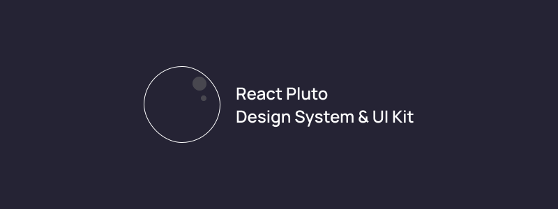

# React Pluto Component Design System + UI Kit



A package of small but beautiful React components from the planet Pluto. To install the latest version, run this installation command.

```cmd
npm install react-pluto --save-dev
```

### How to import and start using Pluto Components

- For an instance, consider a component view named as `ScreenView`, and we need to use a button component.

```javascript
import { Button } from 'react-pluto';

export default function ScreenView() {
    return (
        <div className="screen-view">
            <Button>
                Pluto Button
            </Button>
        </div>
    )
}
```

- Passing custom properties is extremely easy in these components. You can easily pass style, className, id, methods, actions as props.

```javascript
import { Button } from 'react-pluto';

export default function ScreenView() {
    return (
        <Button style={{ background: 'black', color: 'white', width: '100%' }}>
            Pluto Button
        </Button>
    )
}
```

```javascript
import React, { useState } from 'react';

export default function ScreenView() {
    const [currentValueRef, setCurrentValue] = useState(0);
    return (
        <React.Fragment>
            <h2>Current Value is: {currentValueRef}</h2>
            <Button onClick={() => setCurrentValue(++currentValueRef)}> 
                Pluto Button
            </Button>
        </React.Fragment>
    )
}
```

### Tools and Technologies used

- React
- CSS/SCSS
- Figma
- Notion
- Creative Mind

**We would love if you will raise issues and new feature requests to make this library more better. Thanks for checking out, hope you liked it, if yes then please leave a star :star:**